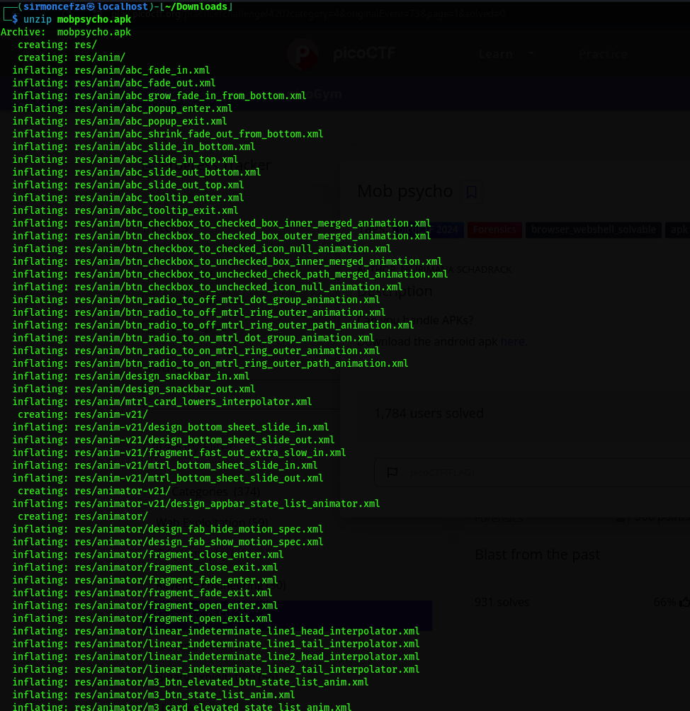
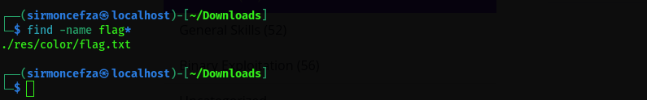
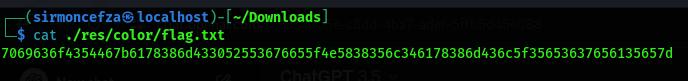
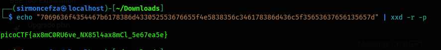

# PicoCTF-2024

## Mob Psycho - 200 | Forensics

### Description: 
Can you handle APKs?
Download the android apk [here](https://artifacts.picoctf.net/c_titan/140/mobpsycho.apk).

### Solve :

we download the apk and from the hint we unzip it : 

after the we search for the flag 

extract it :

clearly it's hex encoded data , we decoded it with `echo "7069636f4354467b6178386d433052553676655f4e5838356c346178386d436c5f35653637656135657d" | xxd -r -p` and we get our flag 

**flag:picoCTF{ax8mC0RU6ve_NX85l4ax8mCl_5e67ea5e}**
