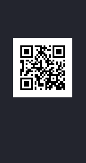

# PicoCTF-2024

## Scan Surprise - 50 | Forensics

### Description: 
I've gotten bored of handing out flags as text. Wouldn't it be cool if they were an image instead?
You can download the challenge files here:
[challenge.zip](https://artifacts.picoctf.net/c_atlas/13/challenge.zip)
Additional details will be available after launching your challenge instance.

### Solve :

after unzipping we find this qr code in image : flag.png 

open it with any web qr reader and u get the flag , simple and easy 

**flag:picoCTF{p33k_@_b00_d4ca652e}**