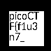

# PicoCTF-2024

## Secret of the Polyglot - 100 | Forensics

### Description: 
The Network Operations Center (NOC) of your local institution picked up a suspicious file, they're getting conflicting information on what type of file it is. They've brought you in as an external expert to examine the file. Can you extract all the information from this strange file?
Download the suspicious file [here](https://artifacts.picoctf.net/c_titan/96/flag2of2-final.pdf).

### Solve :

simple challenge from the hint we know that challenge can be solved when opening the file in different format 

so we open the pdf file we got the second part of the flag 

after that we see a hint in the 2nd part that we have to open in png format 

after we open the file with png format we got the first part and yeah we got our flag

**flag:picoCTF{f1u3n71n_pn9_&_pdf_90974127}**

