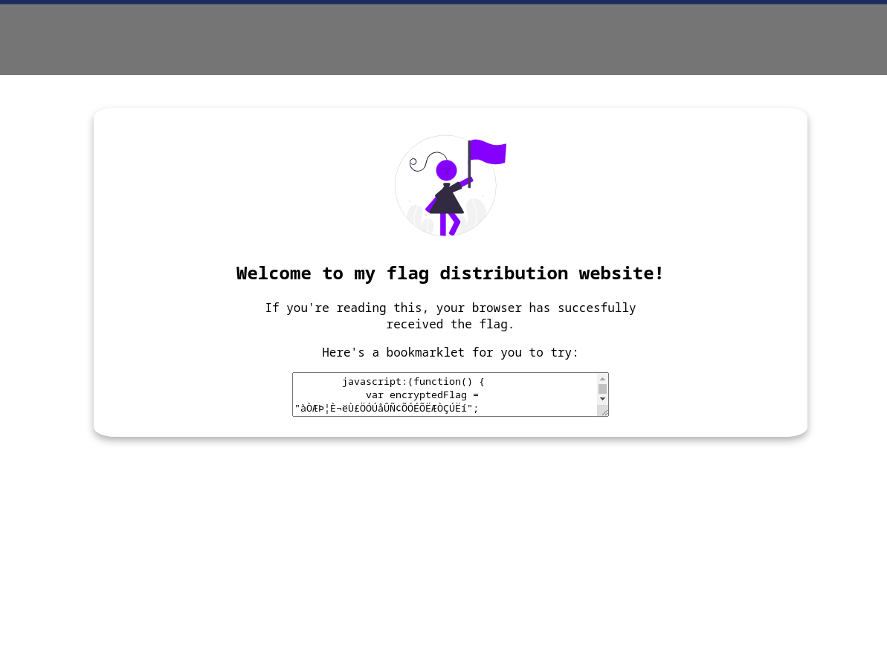

# PicoCTF-2024

## Bookmarklet - 50 | Web Exploitation

### Description:

Why search for the flag when I can make a bookmarklet to print it for me?
Browse [here](http://titan.picoctf.net:51717/), and find the flag!


### Solve :

So we start visite the url of challnge , we got this page:



we check the source code and we got this function:


```
function() {
            var encryptedFlag = "àÒÆަȬë٣֖ÓÚåÛÑ¢ÕÓÉÕËÆÒÇÚËí";
            var key = "picoctf";
            var decryptedFlag = "";
            for (var i = 0; i < encryptedFlag.length; i++) {
                decryptedFlag += String.fromCharCode((encryptedFlag.charCodeAt(i) - key.charCodeAt(i % key.length) + 256) % 256);
            }
            alert(decryptedFlag);
        };
```

we write a simple script and we get our flag :

```
var encryptedFlag = "àÒÆަȬë٣֖ÓÚåÛÑ¢ÕÓÉÕËÆÒÇÚËí";
var key = "picoctf";
var decryptedFlag = "";
for (var i = 0; i < encryptedFlag.length; i++) {
    decryptedFlag += String.fromCharCode((encryptedFlag.charCodeAt(i) - key.charCodeAt(i % key.length) + 256) % 256);
}

console.log(decryptedFlag)
``` 

` flag : picoCTF{p@g3_turn3r_cebccdfe} `

Simple and Easy .

