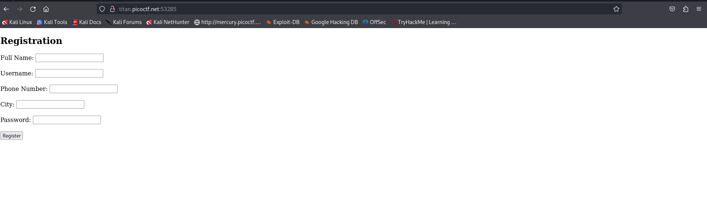
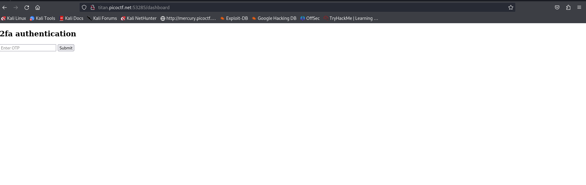
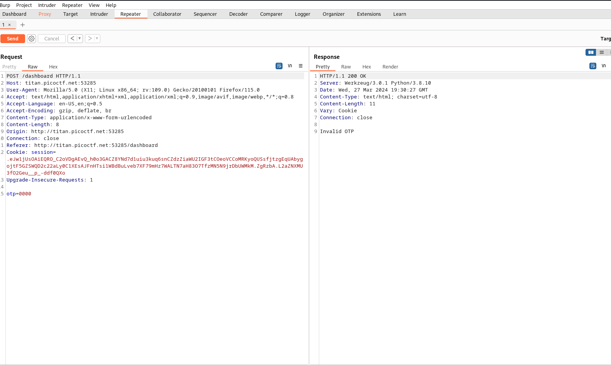
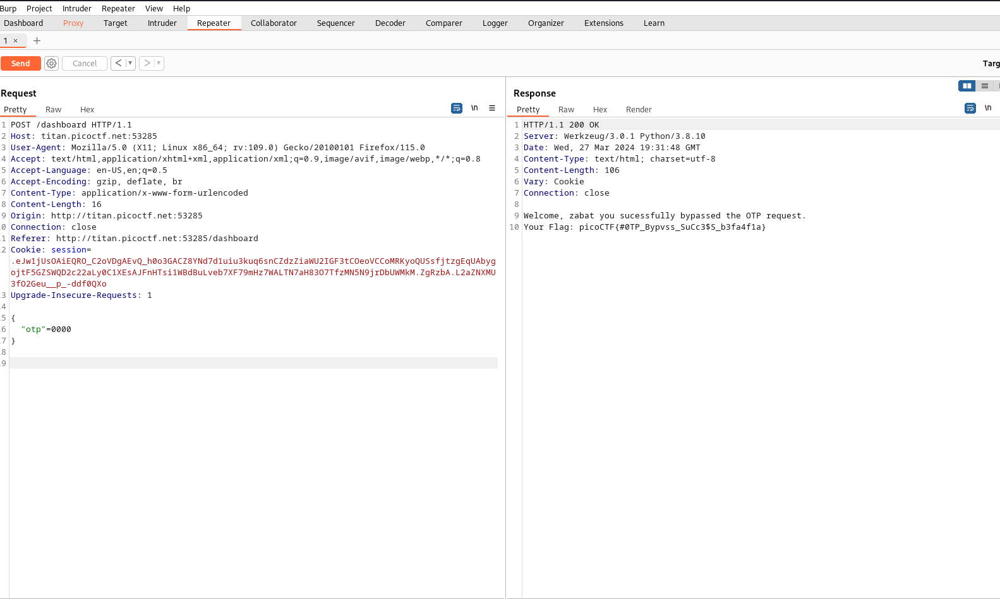

# PicoCTF-2024

## IntroToBurp - 100 | Web Exploitation

### Description:

Try [here](http://titan.picoctf.net:53285/) to find the flag

### Solve :

we launch the instance , when we visite the url we see a registration form 

we complete the form with any random data after we got a 2fa authentification with otp

### Step 2 :

we open our burp and send any otp (i used 0000) and send the request to repeater :

we got Invvalid otp 

after that we try to send otp in body requset `{"otp":0000}` and send it , and yeah we retrieved our gift 

**flag:picoCTF{#0TP_Bypvss_SuCc3$S_b3fa4f1a}**

