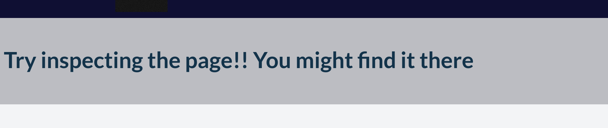

# PicoCTF-2024

## WebDecode - 50 | Web Exploitation

### Description:

Do you know how to use the web inspector?
Start searching [here](http://titan.picoctf.net:53646/) to find the flag

### Solve :

we open the url :

we check the source code and nothing to help 

### Step 2 :

we go to the `about.html` page and we noticed a hint to inspect the page :

we check the source code and find a base64 : `cGljb0NURnt3ZWJfc3VjYzNzc2Z1bGx5X2QzYzBkZWRfMjgzZTYyZmV9`

decode it and we get our flag

`flag: picoCTF{web_succ3ssfully_d3c0ded_283e62fe}`

Easy Peasy 
